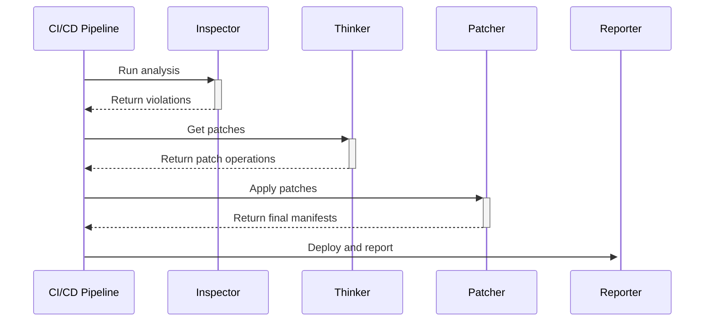
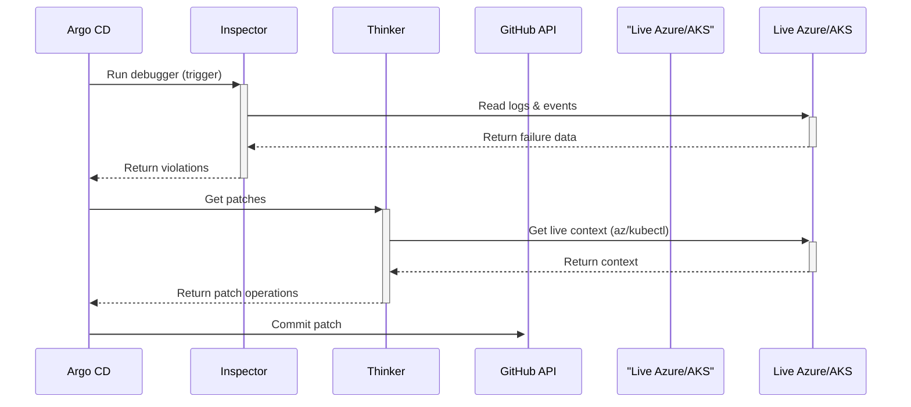

# aks-copilot Architecture Document

## Introduction

This document defines the technical architecture for the `aks-copilot`.

#### Architectural Goals

- **Reliability:** Produce accurate and safe patches.
- **Configurability:** Support different source environments (k3s, OKD, etc.) via config files.
- **Automation:** Maximize automation to reduce developer effort.
- **Maintainability:** Ensure the code is clear and easy to extend.
- **Security & Safety:** Be secure by default and operate within strict, predefined safety boundaries.

#### Starter Template or Existing Project

- N/A - This is a greenfield project.

#### Change Log

| Date       | Version | Description                | Author              |
| :--------- | :------ | :------------------------- | :------------------ |
| 2025-09-19 | 1.0     | Initial architecture draft | Winston (Architect) |

## High Level Architecture

**Design Assumption:** The Inspector will assume all input files are syntactically valid Kubernetes YAML that are functional in a local cluster environment.

#### Workflow 1: Pre-Deployment Check (MVP)

The **Thinker** in this workflow is stateless and does not have live access to Azure. It generates patches based on general rules.

#### Workflow 2: Post-Deployment Debugging (Post-MVP)

The **Thinker** in this workflow is stateful and has live access to run az and kubectl commands to gather context for its patches.

Code snippet

## Tech Stack

#### Cloud Infrastructure

Provider: Microsoft Azure

Key Services: Azure Kubernetes Service (AKS), Azure Key Vault, Azure AI Services

Technology Stack Table

| Category        | Technology                                  |
| :-------------- | :------------------------------------------ |
| Language        | Python 3.11+                                |
| CLI Framework   | Typer                                       |
| Web Framework   | FastAPI                                     |
| AI/Vector Store | FAISS (MVP) -> Azure AI Search (Production) |
| Testing         | Pytest                                      |
| CI/CD           | GitHub Actions                              |
| Infrastructure  | Bicep                                       |
| Monitoring      | Azure Monitor                               |

## Data Models

Violation: Represents a single incompatibility found in a manifest file.

PatchOperation: Represents a single JSON Patch operation to fix a violation.

AgentState: Tracks the agent's status during the post-MVP debugging loop.

## Components

Inspector: Parses manifests and finds Violation objects.

Thinker: Receives Violation objects and generates PatchOperation objects using rules and the LLM.

Patcher: Applies PatchOperations to produce the final, patched manifests.

Reporter: Generates reports, triggers deployment, and sends notifications.

## External APIs

LLM Service: For AI/RAG capabilities.

GitHub API: For CI/CD triggers and committing patches.

Azure Key Vault API: For securely fetching secrets.

Slack API: For sending notifications.

## Database Schema

AI Knowledge Base: Stored in Azure Blob Storage, using a local Azurite emulator for development.

Agent State (Post-MVP): Stored in a copilot_status.json file committed to the Git branch.

## Source Tree

The project will follow a standard Python application structure with a src/ directory containing the core components.

## Infrastructure and Deployment

Infrastructure as Code: Bicep

Deployment Strategy: GitHub Actions will build a container image and deploy to Azure Container Apps.

## Error Handling Strategy

Logging: Structured JSON logging with a unique runId for tracing.

Retries: The agent will retry failed calls to external APIs.

Error Categories: Errors will be classified as Transient, Validation, or Critical to determine the correct response.
