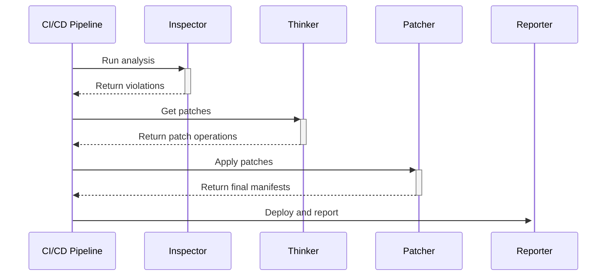
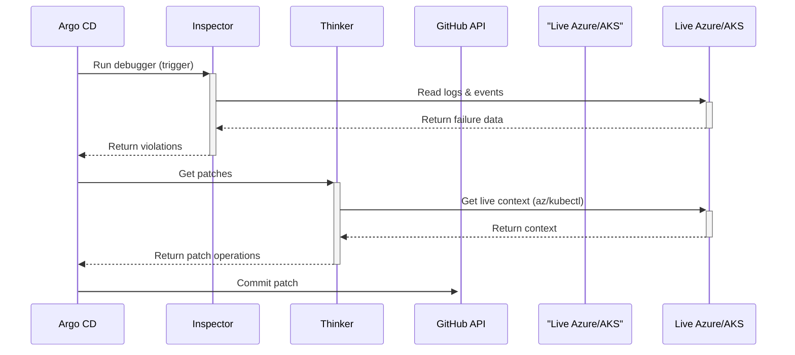

# Workflow 1: Pre-Deployment Check (MVP)

The **Thinker** in this workflow is stateless and does not have live access to Azure. It generates patches based on general rules.

### Workflow 2: Post-Deployment Debugging (Post-MVP)

The **Thinker** in this workflow is stateful and has live access to run az and kubectl commands to gather context for its patches.

Code snippet

